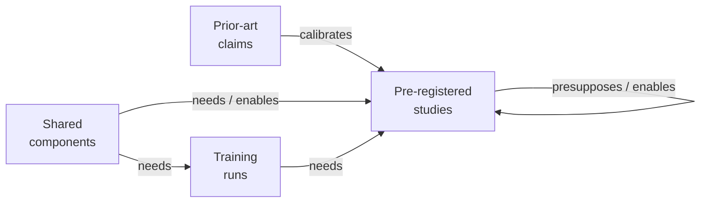
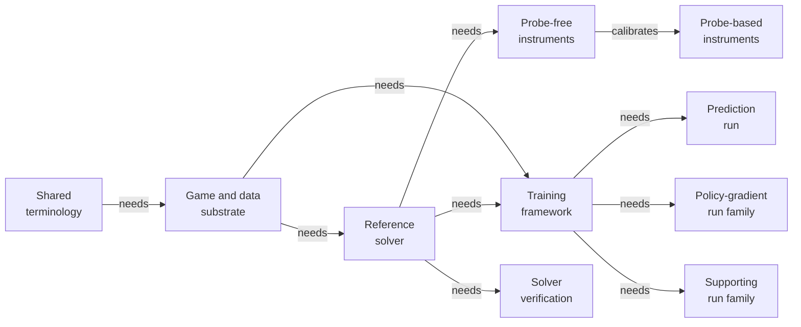
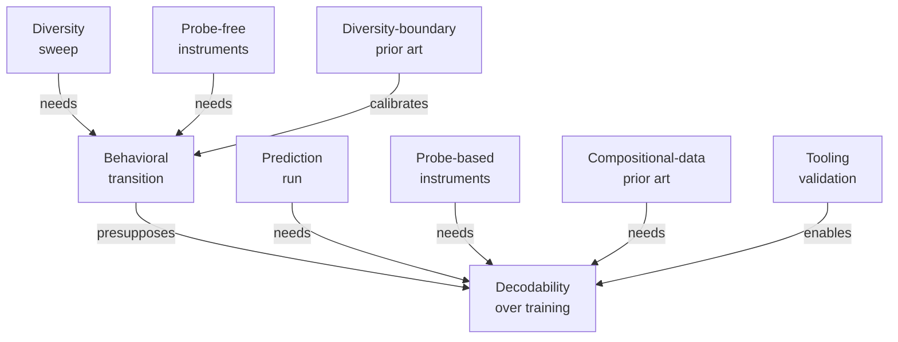
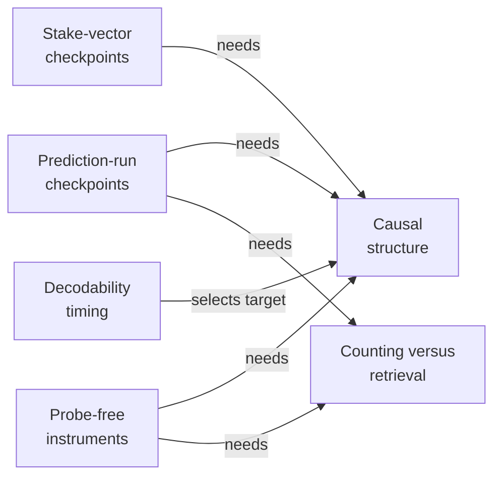
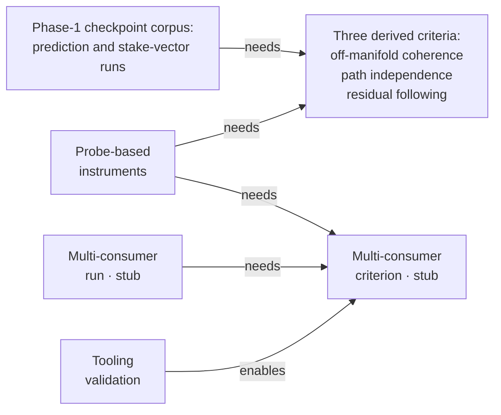
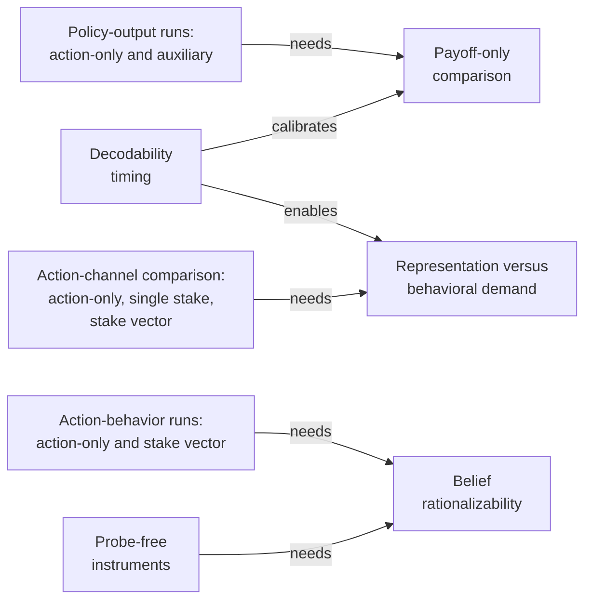
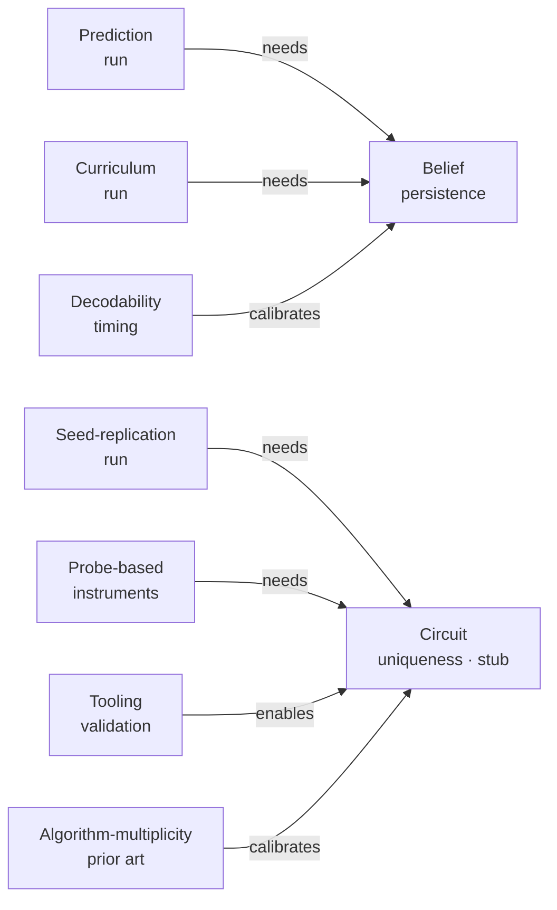

# Rendered Mermaid DAGs

*Generated from `index.md`. Do not edit by hand.*

## Program overview

## Shared foundation and run production

## Calibration and interpretability spine

## Grounded causal evidence

## Derived criterion suite

## Action-channel comparisons

## Training history and replication

